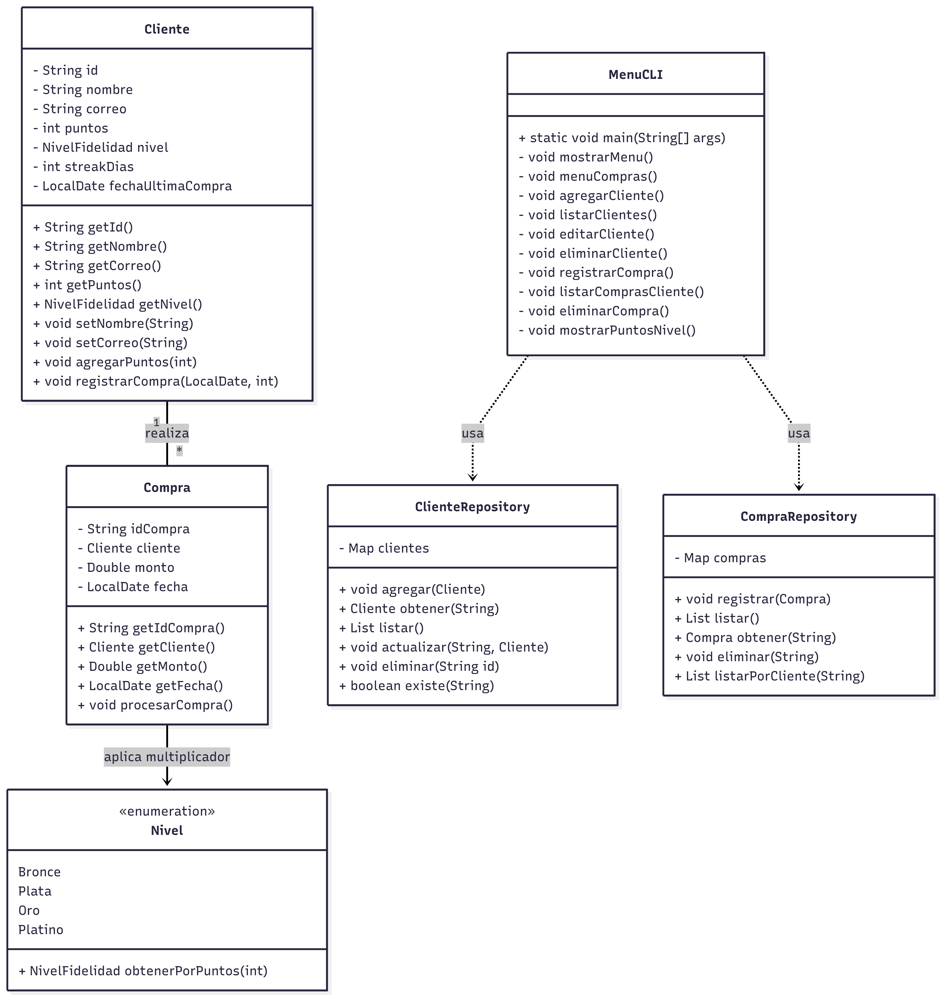

# TarjetasDeFidelidad

## Descripción

Este proyecto es un programa de línea de comandos en **Java 21** que implementa un sistema de fidelidad para una cadena de tiendas de conveniencia.  
Permite gestionar clientes, registrar compras y calcular puntos de fidelidad con niveles (Bronce, Plata, Oro, Platino) y bonos por compras consecutivas.

---

## Diseño y Arquitectura

- **Modelo orientado a objetos** con clases `Cliente`, `Compra` y enumeración `NivelFidelidad`.
- **Repositorios en memoria** para gestionar datos (`ClienteRepositorio`, `CompraRepositorio`).
- **Lógica de negocios** implementada en las clases de modelo (cálculo de puntos, streaks, niveles).
- **Interfaz por consola** con menús para gestionar clientes y compras.
- Se implementó **TDD** con pruebas unitarias JUnit 5 para validar la lógica.

### Diagrama UML (simplificado)

## 

## Requisitos

- Java 21 o superior
- Maven para compilación y ejecución

---

## Cómo compilar y ejecutar

1. Clonar el repositorio

```bash
git clone https://github.com/Francoreinoso/TarjetasDeFidelidad
cd tarjeta-fidelidad
```

2. Compilar y ejecutar con Maven

```bash
mvn clean compile exec:java -Dexec.mainClass="Main"
```

## Ejecutar los tests

```bash
mvn test
```

Si se está usando IntelliJ, podemos ejecutar y comprobar el coverage haciendo click derecho
en la carpeta test>java y luego seleccionando More Run/Debug y Run 'tests in Java' with coverage.

Los tests cubren:

- Validación de correos.

- Cálculo y acumulación de puntos con multiplicadores y streaks.

- Gestión de niveles de fidelidad.

- Funcionalidad CRUD en repositorios.

---

## Cobertura de código

Se utilizó JaCoCo con Maven para medir la cobertura de tests.

- Cobertura cercana al 100% en la lógica de negocios y repositorios.

- El archivo Main.java no está cubierto por pruebas unitarias debido a que contiene lógica de interacción por consola.

## Consideraciones finales

- La persistencia es en memoria, por lo que inicialmente se encuentra vacía. Los datos se pierden al cerrar la aplicación.

- La funcionalidad actual no revierte puntos si se elimina una compra.
